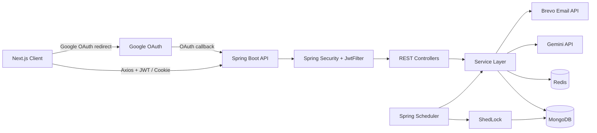
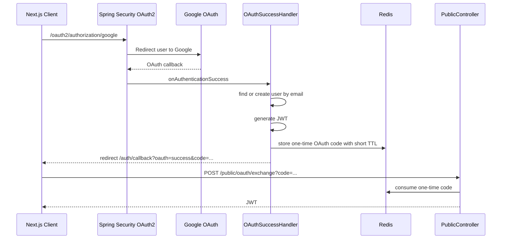
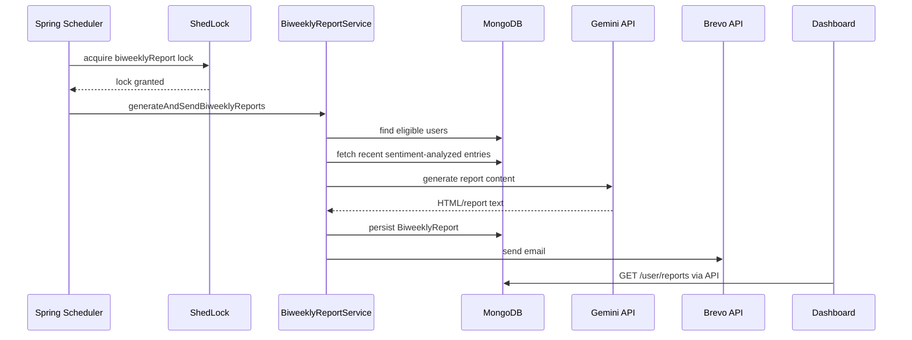

# InkFold

InkFold is a full-stack journaling application for writing private journal entries, organizing them into collections, and turning entries into mood analytics and biweekly mental health reports. The backend is a Spring Boot API with Spring Security, JWT, Google OAuth, MongoDB, Redis caching, Gemini-powered analysis, Brevo email delivery, and ShedLock-backed scheduled jobs. The frontend is a Next.js app with rich entry editing, dashboard analytics, dark mode, and report viewing.

## Features

- Local username/password signup and login with BCrypt password hashing.
- Google OAuth login with a one-time backend token exchange so JWTs are not exposed in redirect URLs.
- JWT-secured APIs with optional HttpOnly OAuth cookie fallback.
- Journal CRUD with rich text editing and collection assignment.
- Collections for grouping entries.
- Gemini sentiment analysis for entries, including sentiment score, label, emotions, and keywords.
- Dashboard metrics for total entries, average mood, mood summaries, and mood timeline.
- Analytics ranges: last 7, 15, 30, 90 days, and all time.
- Historical analytics backfill for older entries that predate the direct `userId` journal-entry index.
- Biweekly AI report generation with report persistence in MongoDB.
- Brevo email delivery for generated reports.
- Redis caching for user profiles, entries, collections, analytics, report content, and OAuth token exchange.
- ShedLock-protected scheduled report generation to prevent duplicate CRON execution across app instances.
- MongoDB indexes for user email lookup, report eligibility scans, user/date entry queries, and user/collection queries.
- Dark and light theme support.

## Tech Stack

### Backend

- Java 17
- Spring Boot 2.7.16
- Spring Web MVC
- Spring Security
- Spring OAuth2 Client
- Spring Data MongoDB
- Spring Data Redis
- JJWT
- Lombok
- Bean Validation
- WebClient for Gemini API calls
- OkHttp for Brevo API calls
- ShedLock with MongoDB lock provider
- Maven

### Frontend

- Next.js 16
- React 19
- Tailwind CSS 4
- Radix UI and shadcn-style components
- TanStack Query
- Axios
- TipTap editor
- Recharts
- next-themes
- Sonner toasts
- Lucide icons

### External Services

- MongoDB for primary persistence
- Redis for caching, OAuth code exchange, and transient report cache data
- Google OAuth for social login
- Google Gemini for sentiment analysis and report generation
- Brevo for transactional email delivery

## High-Level Architecture



## Backend Architecture

The backend follows a controller-service-repository structure:

- `controller`: REST endpoints for auth, users, journals, collections, reports, analytics, and admin test operations.
- `services`: business logic for users, journal entries, collections, analytics, sentiment analysis, report generation, Redis, email, and OAuth token exchange.
- `repository`: Spring Data MongoDB repositories.
- `entity`: MongoDB documents for users, entries, collections, and reports.
- `config`: Spring Security, CORS, Redis, OAuth success handling, auth cookies, and ShedLock.
- `filter`: JWT authentication filter.
- `dto`: request and response mapping for API-safe payloads.

<!-- ## Data Model Overview

```mermaid
erDiagram
    USER ||--o{ JOURNAL_ENTRY : owns
    USER ||--o{ COLLECTION : owns
    USER ||--o{ BIWEEKLY_REPORT : receives
    COLLECTION ||--o{ JOURNAL_ENTRY : groups

    USER {
        ObjectId id
        string userName
        string email
        boolean sentimentAnalysis
        string authProvider
        string password
        string[] roles
    }

    JOURNAL_ENTRY {
        ObjectId id
        ObjectId userId
        ObjectId collectionId
        string title
        string content
        datetime date
        double sentimentScore
        string sentimentLabel
        string[] emotions
        string[] keywords
        datetime sentimentAnalyzedAt
    }

    BIWEEKLY_REPORT {
        ObjectId id
        ObjectId userId
        string reportContent
        datetime periodStart
        datetime periodEnd
        double avgSentimentScore
        int totalEntries
        string[] topEmotions
        string[] topKeywords
        datetime generatedAt
    }
``` -->

## Spring Security Flow

### Local Login

```mermaid
sequenceDiagram
    participant Client as Next.js Client
    participant Public as PublicController
    participant Auth as AuthenticationManager
    participant UserDetails as UserDetailsService
    participant JWT as JwtUtil
    participant API as Secured APIs

    Client->>Public: POST /public/login
    Public->>Auth: authenticate(username, password)
    Auth->>UserDetails: loadUserByUsername
    UserDetails-->>Auth: user + BCrypt password hash + roles
    Auth-->>Public: authenticated
    Public->>JWT: generateToken(username)
    Public-->>Client: JWT
    Client->>API: Authorization: Bearer JWT
```

### Google OAuth Login



The OAuth flow intentionally avoids putting the JWT in the redirect URL. A short-lived, one-time code is sent to the frontend instead. The frontend exchanges it for a JWT and stores the JWT in `localStorage`. The backend also sets an HttpOnly auth cookie as a fallback. Logout clears frontend token state and the OAuth cookie; JWT revocation is intentionally not implemented.

## Analytics Workflow

1. The dashboard calls `GET /user/analytics?range=all` by default.
2. `AnalyticsService` checks Redis using a versioned analytics key.
3. Entries are loaded using indexed `journal_entries.userId` queries.
4. If a user has legacy entries that existed before `userId` was added, the service reloads the user from MongoDB and backfills missing `userId` values from the historical DBRef list.
5. Analytics are computed from dated entries:
   - total entries
   - entries per day
   - average mood
   - daily mood timeline
   - top emotions
   - top keywords
6. Results are cached for a short TTL.

Mood is derived from sentiment score using:

```text
mood = (sentimentScore + 1.0) * 4.5 + 1.0
```

This maps sentiment from `[-1.0, 1.0]` to a mood score from `[1, 10]`.

## Biweekly Report Workflow



Report generation is idempotency-aware:

- ShedLock prevents multiple instances from running the same scheduled job concurrently.
- Report content is cached by user and biweekly period.
- New reports are persisted to MongoDB for dashboard visibility.
- Email delivery uses sanitized logs and does not log API keys or full payloads.

## API Overview

### Public

- `GET /public/health-check`
- `POST /public/signup`
- `POST /public/login`
- `POST /public/oauth/exchange?code=...`
- `POST /public/logout-cookie`

### Journal Entries

- `GET /journals`
- `GET /journals/id/{id}`
- `POST /journals`
- `PUT /journals/id/{id}`
- `DELETE /journals/id/{id}`
- `PUT /journals/id/{id}/collection/{collectionId}`
- `PUT /journals/id/{id}/collection`

### Collections

- `GET /collections`
- `GET /collections/id/{id}`
- `POST /collections`
- `PUT /collections/id/{id}`
- `DELETE /collections/id/{id}`
- `GET /collections/id/{id}/entries`

### User, Reports, and Analytics

- `GET /user/me`
- `PUT /user`
- `PUT /user/username`
- `PUT /user/sentiment-analysis`
- `DELETE /user`
- `GET /user/reports`
- `GET /user/reports/{id}`
- `GET /user/analytics?range=7d|15d|30d|90d|all`

### Admin and Diagnostics

- `GET /admin/all-users`
- `POST /admin/test-email?email=...`
- `POST /admin/test-report/{username}`
- `POST /admin/clear-cache/{username}`
- `GET /admin/env-check`

Admin endpoints require an authenticated user with `ADMIN` role.

## Caching and Indexing

Redis is used for:

- user profile cache
- recent entry cache
- collection cache
- analytics cache
- report content cache
- OAuth one-time code exchange

MongoDB indexes include:

- unique username index
- email index for OAuth user lookup
- sentiment-analysis/email compound index for report eligibility
- `journal_entries.userId + date` compound index for dashboard and entry lists
- `journal_entries.userId + collectionId` compound index for collection views
- report `userId` index for dashboard report history

These indexes reduce full collection scans and avoid common N+1 access patterns by querying journal entries directly by owner.

## Local Development

### Prerequisites

- Java 17
- Maven
- Node.js compatible with Next.js 16
- MongoDB
- Redis
- Google OAuth credentials
- Gemini API key
- Brevo API key

### Backend Environment

Create environment variables for the Spring Boot app:

```bash
ENV=dev
PORT=8080
MONGO_URI=mongodb://localhost:27017/journalApp
MONGO_DB_NAME=journalApp
REDIS_HOST=localhost
REDIS_PORT=6379
REDIS_PASSWORD=
JWT_SECRET_KEY=replace-with-a-long-secret
FRONTEND_URL=http://localhost:3000
GOOGLE_CLIENT_ID=replace-me
GOOGLE_CLIENT_SECRET=replace-me
GEMINI_API_KEY=replace-me
BREVO_API_KEY=replace-me
BREVO_FROM_EMAIL=verified-sender@example.com
BREVO_FROM_NAME=InkFold
```

Run the backend:

```bash
mvn spring-boot:run
```

### Frontend Environment

Create `frontend/.env.local`:

```bash
NEXT_PUBLIC_API_URL=http://localhost:8080
```

Run the frontend:

```bash
cd frontend
npm install
npm run dev
```

Open:

```text
http://localhost:3000
```

## Testing

Run backend tests:

```bash
mvn test
```

Run frontend lint:

```bash
cd frontend
npm run lint
```

## Deployment Notes

- Backend can be deployed as a Dockerized Spring Boot service.
- Frontend can be deployed as a Next.js app.
- Set `FRONTEND_URL` to the deployed frontend origin for CORS and OAuth redirects.
- Set `NEXT_PUBLIC_API_URL` to the deployed backend URL.
- Enable MongoDB auto-index creation or create the documented indexes manually in production.
- Use a shared MongoDB-backed ShedLock collection if multiple backend instances are deployed.
- Keep API keys in environment variables only.

## Why This Project Is Interesting

InkFold is not just CRUD with auth. It combines:

- secure mixed auth flows with local login and OAuth
- AI enrichment of user-generated content
- scheduled report generation and email delivery
- production-oriented caching, indexing, and locking
- historical data migration/backfill behavior
- a polished frontend dashboard with rich text editing and analytics

That makes it a compact but realistic example of building and operating a modern full-stack application.
